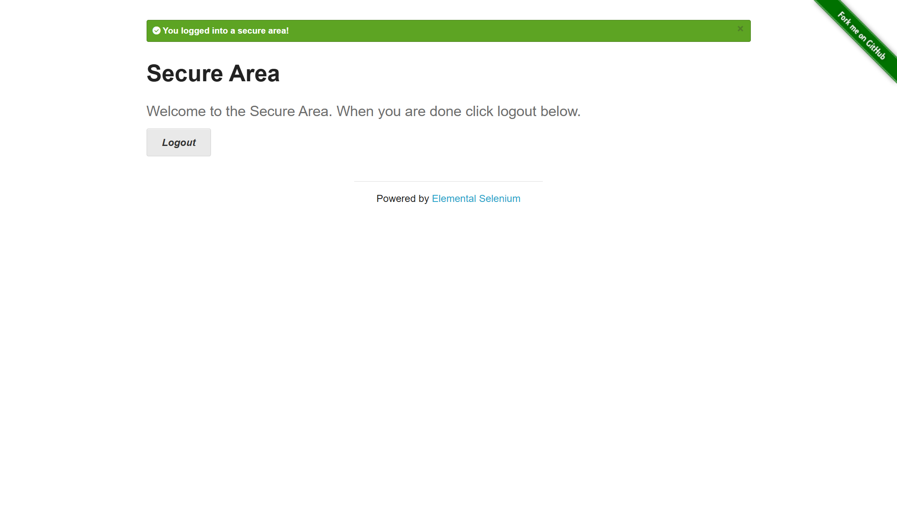
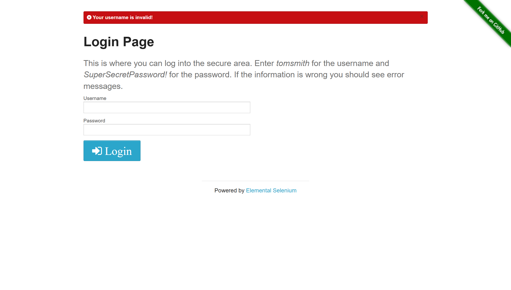

# QA Automation Framework Using Python, Selenium & PyTest

A robust and scalable test automation framework built with Python, Selenium WebDriver, and PyTest for web application testing. This framework follows the Page Object Model (POM) design pattern to ensure maintainable and reusable test code.

## Features

- **Page Object Model (POM)**: Organized structure with separate page objects for better code maintainability
- **PyTest Framework**: Powerful test framework with fixtures and detailed reporting
- **Selenium WebDriver**: Cross-browser automation support
- **WebDriver Manager**: Automatic browser driver management (no manual driver downloads needed)
- **HTML Reports**: Generates detailed HTML test reports using pytest-html
- **Screenshot Capture**: Automatic screenshot capture on test failures and manual screenshot support during test execution
- **Explicit Waits**: Implements WebDriverWait with expected conditions for reliable element interactions
- **Modular Design**: Easy to extend with new test cases and page objects

## Project Structure

```
QA-Automation-Framework-Using-Python-Selenium-PyTest/
│
├── pages/                      # Page Object Model classes
│   └── login_page.py          # Login page object with locators and methods
│
├── tests/                      # Test cases
│   └── test_login.py          # Login functionality test cases
│
├── reports/                    # Generated test reports
│
├── screenshots/                # Screenshots captured during test execution
│   ├── valid_login.png        # Example: Valid login screenshot
│   ├── invalid_login.png      # Example: Invalid login screenshot
│   └── *_failed.png           # Auto-captured screenshots for failed tests
│
├── conftest.py                # PyTest configuration and fixtures
├── requirements.txt           # Project dependencies
├── LICENSE                    # MIT License
└── README.md                  # Project documentation
```

## Prerequisites

- Python 3.7 or higher
- pip (Python package installer)
- Chrome browser (for running tests)

## Installation

1. **Clone the repository:**
   ```bash
   git clone https://github.com/sandeep12222300/QA-Automation-Framework-Using-Python-Selenium-PyTest.git
   cd QA-Automation-Framework-Using-Python-Selenium-PyTest
   ```

2. **Create a virtual environment (recommended):**
   ```bash
   python -m venv venv
   ```

3. **Activate the virtual environment:**
   - On Windows:
     ```bash
     venv\Scripts\activate
     ```
   - On macOS/Linux:
     ```bash
     source venv/bin/activate
     ```

4. **Install dependencies:**
   ```bash
   pip install -r requirements.txt
   ```

## Technologies Used

- **Python**: Programming language
- **Selenium 4.39.0**: Web automation framework
- **PyTest 8.0.0**: Testing framework
- **pytest-html 4.1.1**: HTML report generation
- **webdriver-manager 4.0.1**: Automatic browser driver management

## Usage

### Running Tests

Run all tests:
```bash
pytest
```

Run tests with verbose output:
```bash
pytest -v
```

Run specific test file:
```bash
pytest tests/test_login.py
```

Run specific test function:
```bash
pytest tests/test_login.py::test_valid_login
```

Generate HTML report:
```bash
pytest --html=reports/report.html
```

Run tests with detailed output and HTML report:
```bash
pytest -v --html=reports/report.html --self-contained-html
```

### Writing New Tests

1. Create a new page object in the `pages/` directory following the POM pattern
2. Add test cases in the `tests/` directory
3. Use the `browser` fixture provided in `conftest.py` for WebDriver instance

Example test structure:
```python
from pages.your_page import YourPage

def test_example(browser):
    page = YourPage(browser)
    page.open()
    # Your test steps here
    assert expected_result == actual_result
```

## Page Object Model (POM)

The framework uses the Page Object Model design pattern where:
- Each web page is represented by a class
- Page elements are defined as class attributes using locator tuples
- Page interactions are implemented as class methods
- Test logic is separated from page implementation
- Explicit waits are used for reliable element interactions

Example:
```python
from selenium.webdriver.support.ui import WebDriverWait
from selenium.webdriver.support import expected_conditions as EC

class LoginPage:
    def __init__(self, driver):
        self.driver = driver
        self.wait = WebDriverWait(driver, 10)
    
    username = (By.ID, "username")
    password = (By.ID, "password")
    
    def login(self, user, pwd):
        self.driver.find_element(*self.username).send_keys(user)
        self.driver.find_element(*self.password).send_keys(pwd)
    
    def wait_for_message(self):
        return self.wait.until(
            EC.visibility_of_element_located(self.message)
        )
```

## Configuration

The `conftest.py` file contains PyTest fixtures and configuration:
- **browser fixture**: Initializes and manages the WebDriver instance
- Automatically handles browser setup and teardown
- Maximizes browser window for test execution
- **pytest_runtest_makereport hook**: Automatically captures screenshots when tests fail

### Screenshot on Failure

The framework automatically captures screenshots when a test fails. Screenshots are saved in the `screenshots/` directory with the naming convention `{test_name}_failed.png`.

```python
@pytest.hookimpl(hookwrapper=True)
def pytest_runtest_makereport(item):
    outcome = yield
    report = outcome.get_result()
    
    if report.when == "call" and report.failed:
        driver = item.funcargs.get("browser")
        if driver:
            os.makedirs("screenshots", exist_ok=True)
            driver.save_screenshot(f"screenshots/{item.name}_failed.png")
```

## Screenshots

The framework supports screenshot capture in two ways:

1. **Automatic on Failure**: Screenshots are automatically captured when a test fails (configured in `conftest.py`)
2. **Manual Capture**: Tests can manually capture screenshots at any point during execution

Example of manual screenshot capture:
```python
import os

def test_login(browser):
    page = LoginPage(browser)
    page.open()
    page.login("username", "password")
    
    # Capture screenshot manually
    os.makedirs("screenshots", exist_ok=True)
    browser.save_screenshot("screenshots/login_success.png")
    
    assert "success" in page.get_message_text()
```

All screenshots are stored in the `screenshots/` directory.

### Example Screenshots

#### Valid Login Test

*Screenshot captured during a successful login test*

#### Invalid Login Test

*Screenshot captured during an invalid login attempt test*

## License

This project is licensed under the MIT License - see the [LICENSE](LICENSE) file for details.

## Author

**B Sandeep**

## Contributing

Contributions are welcome! Please feel free to submit a Pull Request.

1. Fork the project
2. Create your feature branch (`git checkout -b feature/AmazingFeature`)
3. Commit your changes (`git commit -m 'Add some AmazingFeature'`)
4. Push to the branch (`git push origin feature/AmazingFeature`)
5. Open a Pull Request

## Future Enhancements

- Add support for multiple browsers (Firefox, Edge, Safari)
- Implement parallel test execution
- Add API testing capabilities
- Integrate with CI/CD pipelines
- Implement data-driven testing with external data sources
- Add logging functionality
- Add video recording for test execution
